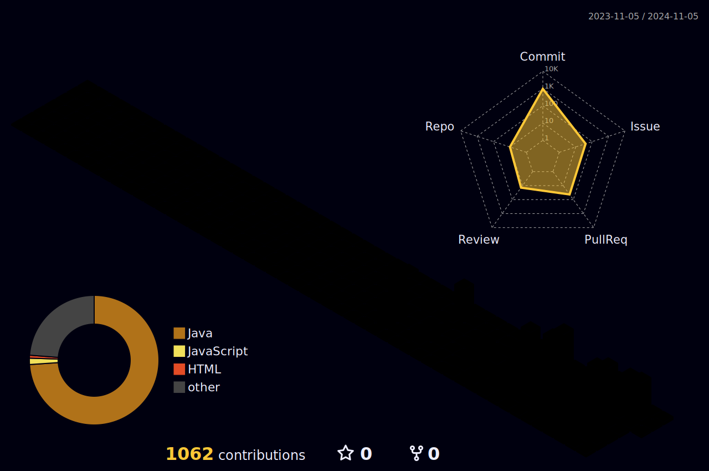

<!--

-->

## 👋 Hi there 

  

## 🗨️ About me

 
• 🎍 I'm currently learning Back-End skils
   
• 💻 Hanwha SW Beyond Camp 9기 (2024.06 ~)
   
• 🦁 멋쟁이 사자처럼 9기 (2023.01 ~ 2023.08)
   
• 🔍 2022 초기창업패키지 창업클럽 (2022.06 ~ 2022.11)  
   
• 🧪 'DKU 모바일 기술 연구실' 학부 연구원 & 연구실장 (2021.03 ~ 2023.02)
   
• 🏫 Dankook Univ. (2018.03 ~ 2024.02)
 
 
 

## 🔨 Once I've used
<strong>Language</strong>
 
  

<strong>Server</strong>
 

<strong>Database</strong>
 
 	

<strong>Framwork</strong>
 
  

<strong>OS</strong>
 
 

<strong>Hosting</strong>
 

<strong>Others</strong>
 
    
 

 

## 📞 Contact 
📧wjdwnstj0810@gmail.com 
<!--
  
-->
 

## Ranking

 
 

## Some of my Github Stats

